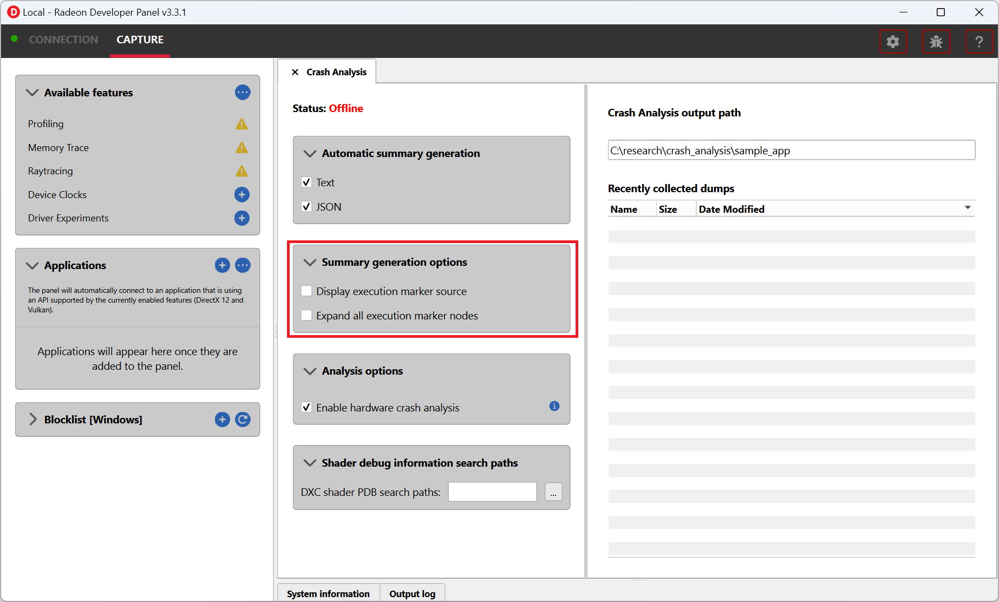

.. _help-manual:

Help Manual
===========
The Radeon™ GPU Detective
-------------------------

The Radeon GPU Detective (RGD) is a tool that assists developers in post-mortem analysis of GPU crashes. 
The tool allows developers to generate and analyze AMD GPU crash dumps and produce information that 
can help narrow down the search for a crash's root cause. Some of the information that is included in 
the crash analysis reports that the tool generates:

* Execution markers for each command buffer that was executing during the crash, pointing to render passes and draw calls.
* The offending virtual address, along with information about all the resources that resided in the relevant address ranges, for crashes that are identified as being caused by a page fault.

System requirements
-------------------
* Operating system: Windows® 10 or 11.
* GPU: RDNA™2 (RX 6000 series), RDNA™3 (RX 7000 series) or RDNA™ 4 (RX 9000 series) card.
* Driver: Radeon Adrenalin™ driver with Crash Analysis support.

.. note::
   * You will need a game or other application that is crashing the GPU (currently **Direct3D 12** or **Vulkan** are the APIs supported by the tool).
   * **To make the most out of the tool**, the application should:

       * Use string markers around render passes:
           * D3D12: Using the AMD GPU Services (AGS) library - same as supported by RGP.
           * Vulkan: Using the VK_EXT_debug_utils extension - functions ``vkCmdBeginDebugUtilsLabelEXT``, ``vkCmdEndDebugUtilsLabelEXT``.
       * Name GPU resources (heaps, buffers, textures), as these strings appear in the crash analysis summary files and can help identifying the relevant resources in case of a page fault:
           * D3D12: Using ``ID3D12Object::SetName()``.
           * Vulkan: Using VK_EXT_debug_utils extension - function ``vkSetDebugUtilsObjectNameEXT``.

Using the tool
--------------
Generating AMD GPU crash dumps
^^^^^^^^^^^^^^^^^^^^^^^^^^^^^^
To learn how to capture AMD GPU crash dump files (.rgd files) and generate crash analysis summary files (text/JSON), please refer to the :ref:`quickstart-guide`.

The crash analysis summary file
^^^^^^^^^^^^^^^^^^^^^^^^^^^^^^^
The RGD command line tool (rgd.exe) can parse AMD GPU crash dump files (.rgd files) and produce crash analysis report files in text or JSON format.
Both the text and JSON summary files include the same information, in different representation. The JSON format can be useful for automated processing of crash reports.
For simplicity, we will refer here to the human-readable textual output.

.. note::
	The RGD crash analysis text summary files are encoded in UTF-8 and use some Unicode characters to print
	the execution marker tree, so make sure you use a text editor that supports this, like Microsoft® Visual Studio Code.

RGD crash analysis output files include the following information by default:	

* **Metadata** about the crash analysis summary file and session.
* **System information** (CPUs, GPUs, driver, OS etc.).
* **Execution marker tree** for each command buffer that was in flight during the crash, pointing to render passes and draw calls.
* **Summary of the in-progress markers** (similar to the execution marker tree, just without the hierarchy and only including execution markers that were in progress during the crash).
* **Page fault summary** for crashes that were determined to be caused by a page fault. Otherwise, the tool will explicitly mention that no page fault was observed.

Here are some more details about the crash analysis file's contents:

Crash analysis file information
"""""""""""""""""""""""""""""""
This section is titled ``CRASH ANALYSIS FILE`` and contains information about the current summary report and the crashing process.

* **Input crash dump file name**: the full path to the .rgd file that was used to generate this file.
* **Input crash dump file creation time**: the creation time of the crash dump (.rgd) file.
* **RGD CLI version used**: the RGD command line tool version that was used to generate this summary file.
* **Crash analysis file format version**: schema version of the current file.
* **Crashing process ID**: the process ID of the crashing application.
* **Crashing executable full path**: full path to the crashing application executable.

System information
""""""""""""""""""
This section is titled ``SYSTEM INFO`` and includes information about the system on which the crash happened:

* **Operating system** information
* **Graphics driver** information
* List of active Driver Experiments
* Details about the installed **CPUs**
* Details about the installed **GPUs**

Driver Experiments for Crash Analysis
"""""""""""""""""""""""""""""""""""""

RGD v1.3 supports a powerful new feature called **Driver Experiments** which lets you toggle certain driver features and optimizations that can change the behavior of your application without modifying its source code or configuration. This is done using Driver Experiments that control the low-level behavior of the Radeon Adrenalin driver. These experiments control features like raytracing or mesh shader support, compiler optimizations and more and can be useful in debugging GPU crashes.

AMD GPU crash dumps (.rgd files) record the list of Driver Experiments that were active during the crash analysis session, so that you always have an accurate picture of the driver configuration with which your app crashed. RGD's crash analysis output summary text file will display the list of Driver Experiments that were active as part of the System Info section. This information will also be available in RGD's machine-readable JSON output file.
For more details about this feature, please refer to the :ref:`quickstart-guide`.

For a detailed description of each supported experiment, please refer to the Driver Experiments section of the `RDP documentation <https://gpuopen.com/manuals/rdp_manual/rdp_manual-index/>`_.

Here is an example of active Driver Experiments::

    ===========
    SYSTEM INFO
    ===========

    Driver info
    ===========
    ...
    Experiments : total of 4 Driver Experiments were active while capturing the AMD GPU crash dump:
	    1. Disable sampler feedback support
	    2. Disable raytracing support
	    3. Disable variable rate shading
	    4. Hull shader wave size: Force 32 threads per wave

Markers in progress
"""""""""""""""""""

This section is titled ``MARKERS IN PROGRESS`` and contains information **only** about the execution markers that were in progress during the crash for each command buffer that was determined to be in flight during the crash.
Here is an example for this section's contents::

    Command Buffer ID: 0x617
    ========================
    Frame 362 CL0/DownSamplePS/Draw [5 repeating occurrences]
    Frame 362 CL0/DownSamplePS/Barrier
    Frame 362 CL0/Bloom/BlurPS/Barrier
    Frame 362 CL0/Bloom/BlurPS/Draw [2 repeating occurrences]

Note that marker hierarchy is denoted by ``/``, forming "paths" like ``marker/marker/draw_call``, similarly to paths in the hierarchy of file systems.

.. _execution_marker_tree:

Execution marker tree
"""""""""""""""""""""
This section is titled ``EXECUTION MARKER TREE`` and contains a tree describing the marker status for each command buffer that was determined to be in flight during the crash.

User-provided marker strings will be wrapped in ``""``. Other markers, which are autogenerated by AMD components will appear as-is without ``""``.

Here is an example execution marker tree::

    Command Buffer ID: 0x617 (Queue type: Direct)
    =============================================
    [>] "Frame 362 CL0"
     ├─[X] "Depth + Normal + Motion Vector PrePass"
     ├─[X] "Shadow Cascade Pass"
     ├─[X] "TLAS Build"
     ├─[X] "Classify tiles"
     ├─[X] "Trace shadows"
     ├─[X] ----------Barrier----------
     ├─[X] "Denoise shadows"
     ├─[X] "GltfPbrPass::DrawBatchList"
     ├─[X] "Skydome Proc"
     ├─[X] "GltfPbrPass::DrawBatchList"
     ├─[>] "DownSamplePS"
     │  ├─[X] ----------Barrier----------
     │  ├─[>] Draw(VertexCount=3, InstanceCount=1)
     │  ├─[>] Draw(VertexCount=3, InstanceCount=1)
     │  ├─[>] Draw(VertexCount=3, InstanceCount=1)
     │  ├─[>] Draw(VertexCount=3, InstanceCount=1)
     │  ├─[>] Draw(VertexCount=3, InstanceCount=1)
     │  └─[>] ----------Barrier----------
     ├─[>] "Bloom"
     │  ├─[>] "BlurPS"
     │  │  ├─[>] ----------Barrier----------
     │  │  ├─[>] Draw(VertexCount=3, InstanceCount=1)
     │  │  ├─[>] Draw(VertexCount=3, InstanceCount=1)
     │  │  └─[ ] ----------Barrier----------
     │  ├─[ ] ----------Barrier----------
     │  ├─[ ] Draw(VertexCount=3, InstanceCount=1)
     │  ├─[ ] Draw(VertexCount=3, InstanceCount=1)
     │  ├─[ ] "BlurPS"
     │  ├─[ ] Draw(VertexCount=3, InstanceCount=1)
     │  └─[ ] ----------Barrier----------
     └─[ ] "Indirect draw simple"

The execution marker status is represented by the following symbols:

* ``[X]`` finished
* ``[>]`` in progress
* ``[#]`` shader in flight
* ``[ ]`` not started

The status (not started, in progress, finished) is determined based on commands that are fetched by the GPU driver 
from a command list and are executed through the stages of the GPU pipeline, which encompasses more than just execution of the shaders.
It means that further passes and draw calls may appear as ``in progress`` before they start executing their shaders,
even if there are barriers between them.

.. note::
   When passes and draw calls markers are shown as ``in progress`` (or ``shader in flight``):
   
   * If they are meant to execute **in parallel** (e.g. drawing 3D objects into the G-buffer), it is possible that they were really in progress when the crash happened
     and any of them could be the crashing one.
   * If they are known to execute **serially with barriers between them** (e.g. screen-space postprocessing passes), then likely the first ``in progress`` (or ``shader in flight``) marker is the one
     that was executing its shader when the crash happened.

Execution marker tree features:

* Thread group count is provided for compute dispatches.
* Queue type is set to 'Direct' for graphics and 'Compute' for compute queue.
* Vertex and instance counts are provided for draw calls.
* Index and instance counts are provided for indexed draw calls.
* In the text summary output, barriers are printed with dashed line to visually separate the set of markers in-between barriers.
* When the crash dump is captured with :ref:`hardware_crash_analysis` feature enabled, a new marker status ``shader in flight`` is added.

The tree structure and contents are also configurable through the RDP options (or using command line options if running the RGD command line tool directly):

* Check the **Display execution marker source** checkbox (or use the ``--marker-src`` command line option) to display a suffix that specifies the component that originated the marker 
  (this could be, for instance, ``[App]`` for a user marker that originated from the crashing application's source code).
* Check the **Expand all execution marker nodes** checkbox (or use the ``--expand-markers`` command line option) for all nodes to be expanded. 
  Note that RGD will collapse nodes which have all of their subnodes in finished state to remove noise and improve the tree's readability.

Page fault summary
""""""""""""""""""

In the case that the crash was determined to be caused by a page fault, this section will list the offending virtual address (VA) where the page fault happened. Otherwise, it will be explicitly mentioned that no page fault was detected.

In addition to the offending VA, this section will present information about any resources that ever resided in this address or explicitly mention that no resources ever resided in this address during the crashing application's lifetime.

If the crash was detected to be caused by a page fault, and resources indeed resided in the relevant VA during the crashing application's lifetime, the following sections will be added as well:

**Resource timeline**

The resource timeline chronologically lists relevant events (such as ``Create``, ``MakeResident`` and ``Destroy``) for all the resources that ever resided in the relevant VA during the crashing application's lifetime.

Here is an example of a resource timeline::

    Timestamp            Event type      Resource type    Resource identifier   Resource size               Resource name
    ---------            ----------      -------------    -------------------   -------------               -------------
    00:00:00.7989056     Create          Buffer           0xfcf3bdca0000014f    671088640 (640.00 MB)       VidMemBuffer
    00:00:00.8009888     Bind            Buffer           0xfcf3bdca0000014f    671088640 (640.00 MB)       VidMemBuffer
    00:00:00.8009888     Make Resident   Buffer           0xfcf3bdca0000014f    671088640 (640.00 MB)       VidMemBuffer
    00:00:06.2607520     Destroy         Buffer           0xfcf3bdca0000014f    671088640 (640.00 MB)       VidMemBuffer

The fields in the ``Resource timeline`` section are:

* **Timestamp**: the timestamp of the event in ``HH:MM:SS.Ticks`` since the start of the crash analysis session.
* **Event type**: the type of the event (such as Create, MakeResident and Destroy).
* **Resource type**: the type of resource (such as buffer or image).
* **Resource identifier**: the resource ID (which is identical to that resource's ID in RMV).
* **Resource size**: the size of the resource.
* **Resource name**: the name of the resource (assuming that the resource was named by the developer using ``ID3D12Object::SetName()`` for DX12 memory objects or using ``vkSetDebugUtilsObjectNameEXT()`` for Vulkan memory objects).

**Associated resources**

Each resource that ever resided in the offending VA during the crashing application's lifetime, will also be listed under the ``Associated resources`` section.
This section will give you more details that can be used to identify the relevant resources that might have played a part in the page fault.

Here is an example of an Image in the ``Associated resources`` section::

    Resource id: 0x5a49f0600000a7f
    	Type: Image
    	Name: Postprocessing render target 4
    	Virtual address:
    		 0x236c00000 [size: 16810352 (16.03 MB), parent address + offset: 0x236c00000 + 0x0, preferred heap: Local (GPU memory, CPU-visible)]
    	Commit type: COMMITTED
    	Attributes:
    		Create flags: PREFER_SWIZZLE_EQUATIONS | FIXED_TILE_SWIZZLE (24576)
    		Usage flags: SHADER_READ | SHADER_WRITE | RESOLVE_DESTINATION | COLOR_TARGET (27)
    		Image type: 2D
    		Dimensions <x, y, z>: 1920 x 1080 x 1
    		Swizzle pattern: XYZW
    		Image format: X16Y16Z16W16_FLOAT
    		Mip levels: 1
    		Slices: 1
    		Sample count: 1
    		Fragment count: 1
    		Tiling type: Optimal
    	Resource timeline:
    		00:00:09.4618368     : Create
    		00:00:09.4622336     : Bind into 0x236c00000
    		00:00:09.4622336     : Make Resident into 0x236c00000
    		00:00:09.4634816     : Destroy

.. note::
   * The ``Attributes`` section will be different for different resource types (for example, a buffer will not have an ``Image format`` attribute).
   * As you can see, each resource will also have its own ``resource timeline`` field which will list only the events that apply to that specific resource.

.. _hardware_crash_analysis:

Hardware Crash Analysis
"""""""""""""""""""""""

RGD v1.4 brings a powerful new feature: Hardware Crash Analysis. When enabled, RGD collects low-level information about the GPU hardware state upon crash and augments the information that is presented in the Crash Analysis (.rgd) output file with meaningful insights.

**New execution marker for in-flight shaders**

With Hardware Crash Analysis, a new execution marker state ``shader in flight`` is added. RGD correlates the wavefronts in flight to the execution markers and marks nodes that had a running wavefront during the crash and mark the node with ``[#]`` symbol.

Here is an example execution marker tree::

    Command Buffer ID: 0x617 (Queue type: Direct)
    =============================================
    [>] "Frame 362 CL0"
     ├─[X] "Depth + Normal + Motion Vector PrePass"
     ├─[X] "Shadow Cascade Pass"
     ├─[X] "TLAS Build"
     ├─[X] "Classify tiles"
     ├─[X] "Trace shadows"
     ├─[X] ----------Barrier----------
     ├─[X] "Denoise shadows"
     ├─[X] "GltfPbrPass::DrawBatchList"
     ├─[X] "Skydome Proc"
     ├─[X] "GltfPbrPass::DrawBatchList"
     ├─[>] "DownSamplePS"
     │  ├─[X] ----------Barrier----------
     │  ├─[#] Draw(VertexCount=3, InstanceCount=1)    <-- has a correlated running wave <SHADER INFO section IDs: {ShaderInfoID1}, API PSO hash = 0xc192105aa67f7e88, API stages: {Pixel}>
     │  ├─[#] Draw(VertexCount=3, InstanceCount=1)    <-- has a correlated running wave <SHADER INFO section IDs: {ShaderInfoID1}, API PSO hash = 0xc192105aa67f7e88, API stages: {Pixel}>
     │  ├─[#] Draw(VertexCount=3, InstanceCount=1)    <-- has a correlated running wave <SHADER INFO section IDs: {ShaderInfoID1}, API PSO hash = 0xc192105aa67f7e88, API stages: {Pixel}>
     │  ├─[#] Draw(VertexCount=3, InstanceCount=1)    <-- has a correlated running wave <SHADER INFO section IDs: {ShaderInfoID1}, API PSO hash = 0xc192105aa67f7e88, API stages: {Pixel}>
     │  ├─[#] Draw(VertexCount=3, InstanceCount=1)    <-- has a correlated running wave <SHADER INFO section IDs: {ShaderInfoID1}, API PSO hash = 0xc192105aa67f7e88, API stages: {Pixel}>
     │  └─[>] ----------Barrier----------
     ├─[>] "Bloom"
     │  ├─[>] "BlurPS"
     │  │  ├─[>] ----------Barrier----------
     │  │  ├─[#] Draw(VertexCount=3, InstanceCount=1) <-- has a correlated running wave <SHADER INFO section IDs: {ShaderInfoID1}, API PSO hash = 0xc192105aa67f7e88, API stages: {Pixel}>
     │  │  ├─[#] Draw(VertexCount=3, InstanceCount=1) <-- has a correlated running wave <SHADER INFO section IDs: {ShaderInfoID1}, API PSO hash = 0xc192105aa67f7e88, API stages: {Pixel}>
     │  │  └─[ ] ----------Barrier----------
     │  ├─[ ] ----------Barrier----------
     │  ├─[ ] Draw(VertexCount=3, InstanceCount=1)
     │  ├─[ ] Draw(VertexCount=3, InstanceCount=1)
     │  ├─[ ] "BlurPS"
     │  ├─[ ] Draw(VertexCount=3, InstanceCount=1)
     │  └─[ ] ----------Barrier----------
     └─[ ] "Indirect draw simple"

**Details about the crashing shader**

For each marker node annotated with ``[#]`` (*shader in flight*), a list of unique associated SHADER INFO section IDs, API PSO hash and a list of API stages for each associated shader are provided.
As you can see, the annotation of the in-flight execution markers contains a reference to ShaderInfoID1. This is a handle which you can use to jump to a new section that is added to the RGD output file: the SHADER INFO section. The name ShaderInfoID1 is arbitrary. Its purpose is to serve as a unique string identifier in the scope of the RGD output text file, which will allow you to jump quickly to the relevant sections of the text file when searching that string.

**SHADER INFO**

This section is titled ``SHADER INFO`` and contains a low-level information about the shaders which are identified as in-flight at the time of the crash.

The ``SHADER INFO`` section will list the following information for each shader that was in flight at the time of the crash::
  * **Shader Info ID** : Arbitrary identifier for the shader info.
  * **API PSO hash**   : Hash value that uniquely identifies the API Pipeline State Object (PSO) that was used to create the shader.
  * **API shader hash**: Hash value that uniquely identifies the shader.
  * **API stage**      : API stage that the shader was used in (e.g. Vertex, Pixel, Compute).
  * **Disassembly**    : Disassembly of the shader showing the consolidated pointers to instruction/s which were being executed by one or more wavefronts at the time of the crash.

Here is an example of a shader info::

    ===========
    SHADER INFO
    ===========

    Shader info ID : ShaderInfoID1
    API PSO hash   : 0xc192105aa67f7e88
    API shader hash: 0x9e7e544426c404defd8c0ea8a6f65c3b (high: 0x9e7e544426c404de, low: 0xfd8c0ea8a6f65c3b)
    API stage      : Pixel

    Disassembly
    ===========
        .
        .
        .
        v_interp_p2_f32 v2, v3, v1, v0 wait_exp:7                  // 000000000360: CD010702 04020303
        s_mov_b32 s4, s5                                           // 000000000368: BE840005
        s_mov_b32 s5, s9                                           // 00000000036C: BE850009
        s_load_b256 s[4:11], s[4:5], null                          // 000000000370: F40C0102 F8000000
        s_waitcnt lgkmcnt(0)                                       // 000000000378: BF89FC07
        v_mul_f32_e64 v3, 2.0, s0                                  // 00000000037C: D5080003 000000F4
        v_mul_f32_e64 v0, 2.0, s1                                  // 000000000384: D5080000 000002F4
        s_delay_alu instid0(VALU_DEP_2) | instskip(NEXT) | instid1(VALU_DEP_2)// 00000000038C: BF870112
        v_sub_f32_e32 v1, v4, v3                                   // 000000000390: 08020704
        v_sub_f32_e32 v3, v2, v0                                   // 000000000394: 08060102
        v_fma_f32 v0, s0, 2.0, v4                                  // 000000000398: D6130000 0411E800
        v_fma_f32 v6, s1, 2.0, v2                                  // 0000000003A0: D6130006 0409E801
        s_mov_b32 s12, 0x8007092                                   // 0000000003A8: BE8C00FF 08007092
        s_mov_b32 s13, 0xfff000                                    // 0000000003B0: BE8D00FF 00FFF000
        s_mov_b32 s14, 0x64500000                                  // 0000000003B8: BE8E00FF 64500000
        s_mov_b32 s15, 0x80000000                                  // 0000000003C0: BE8F00FF 80000000
        s_clause 0x8                                               // 0000000003C8: BF850008
    >   image_sample  v[8:11], [v0, v6], s[4:11], s[12:15] dmask:0xf dim:SQ_RSRC_IMG_2D// 0000000003CC: F06C0F05 0C010800 00000006   <-- ***PAGE FAULT SUSPECT (128 waves)***
        image_sample  v[12:15], [v4, v6], s[4:11], s[12:15] dmask:0xf dim:SQ_RSRC_IMG_2D// 0000000003D8: F06C0F05 0C010C04 00000006
        image_sample  v[18:21], [v1, v6], s[4:11], s[12:15] dmask:0xf dim:SQ_RSRC_IMG_2D// 0000000003E4: F06C0F05 0C011201 00000006
        image_sample  v[22:25], [v0, v2], s[4:11], s[12:15] dmask:0xf dim:SQ_RSRC_IMG_2D// 0000000003F0: F06C0F05 0C011600 00000002
        image_sample  v[26:29], [v4, v2], s[4:11], s[12:15] dmask:0xf dim:SQ_RSRC_IMG_2D// 0000000003FC: F06C0F05 0C011A04 00000002
        image_sample v[30:33], v[1:2], s[4:11], s[12:15] dmask:0xf dim:SQ_RSRC_IMG_2D// 000000000408: F06C0F04 0C011E01
        image_sample  v[34:37], [v0, v3], s[4:11], s[12:15] dmask:0xf dim:SQ_RSRC_IMG_2D// 000000000410: F06C0F05 0C012200 00000003
        image_sample  v[4:7], [v4, v3], s[4:11], s[12:15] dmask:0xf dim:SQ_RSRC_IMG_2D// 00000000041C: F06C0F05 0C010404 00000003
        image_sample  v[0:3], [v1, v3], s[4:11], s[12:15] dmask:0xf dim:SQ_RSRC_IMG_2D// 000000000428: F06C0F05 0C010001 00000003
        s_cmp_eq_i32 s2, 0                                         // 000000000434: BF008002
        s_cbranch_scc1 _L5                                         // 000000000438: BFA20041
        s_waitcnt vmcnt(7)                                         // 00000000043C: BF891FF7
        v_add_f32_e32 v8, v8, v12                                  // 000000000440: 06101908
        v_add_f32_e32 v9, v9, v13                                  // 000000000444: 06121B09
        v_add_f32_e32 v10, v10, v14                                // 000000000448: 06141D0A
        v_add_f32_e32 v11, v11, v15                                // 00000000044C: 06161F0B
        s_waitcnt vmcnt(6)                                         // 000000000450: BF891BF7
        s_delay_alu instid0(VALU_DEP_4) | instskip(NEXT) | instid1(VALU_DEP_4)// 000000000454: BF870214
        v_add_f32_e32 v8, v18, v8                                  // 000000000458: 06101112
        .
        .
        .

The example SHADER INFO section contains a shader (ShaderInfoID1), which matches the execution marker tree. Alongside the shader metadata you can see the relevant subset of the crashing shader's disassembly. If the crash was caused by a page fault that the shader triggered, RGD will mark the offending instruction for you with a ``>`` prefix in the relevant disassembly line and an annotation that marks the page fault culprit suspect and the number of wavefronts that were executing that instruction at the time of the crash. By default, the tool will only include the relevant subset of the shader's disassembly in the output file, in order to remove as much noise as possible. Around a page fault suspect instruction, you will find a small number of instructions to give you the context in which the suspect instruction was executing in. The vertical . . . lines denote filtered instructions. 
In case that you do need to see the full shader disassembly, you can do that by manually running the rgd command line tool with the AMD GPU crash dump (.rgd) file as the input and using the --all-disassembly command line option (refer to the rgd command line tool help manual for more information by running rgd -h).

.. note::
  For the tool to be able to retrieve the additional low-level information for your GPU crash case a few things need to happen. First, you must make sure that the Hardware Crash Analysis checkbox is checked in Radeon Developer Panel's (RDP) Crash Analysis tab (that is the case by default). In addition, since this version of the tool focuses on offending shaders, the GPU crash obviously needs to be triggered by a shader-executing hardware block. If the GPU crash happened somewhere else, no shader will be associated with the execution tree markers, and you will not have the benefits of the new Hardware Crash Analysis mode. However, in the case that your crash case is supported by RGD, you can count on the "standard" (RGD v1.3) information to be included, whether or not the Hardware Crash Analysis feature was applicable to your crash case.

Interpreting the results
^^^^^^^^^^^^^^^^^^^^^^^^

There are generally 3 possible scenarios when interpreting the crash analysis summary report:

.. list-table:: 
   :widths: 25 25 50
   :header-rows: 1

   * - Page Fault Detected?
     - VA has associated resources?
     - Meaning
   * - Yes
     - Yes
     - Attempt to access a resource that’s already destroyed/released (or something similar)
   * - Yes
     - No (means no resource ever resided in this VA) 
     - Either out of bounds access or attempt to access garbage data
   * - No
     - No
     - Hang (use markers to narrow down)
	 

Let's elaborate:

1. If a page fault was detected and **associated resources are found**, it likely means that
   the bug is due to accessing a resource after it has been released or evicted from memory.
   An incorrect (stale or wrongly indexed) descriptor is a possible cause. It would then be a good idea to examine each of the resource's timelines:

   - When resource timeline ends with ``Destroy`` event, the resource was accessed by the GPU after it has been released with a D3D12 ``Release()`` call or a Vulkan equivalent call such as ``vkDestroyImage()`` call.
   - When resource timeline ends with ``Evict`` event, the resource was accessed by the GPU after it was evicted with a D3D12 ``Evict()`` call.
   - When resource timeline doesn't include ``MakeResident`` event, the resource was created as non-resident.

2. If a page fault was detected but **no associated resources are found**, it likely means that
   the GPU (e.g. a shader) tried to access memory at an incorrect address, which may indicate
   a bug in address calculation or indexing.

3. When **no page fault was detected**, it likely means the crash was not related to memory access,
   but a different other type of problem, e.g. a shader hang due to timeout (too long execution) or an infinite loop.

Scope of v1.4
-------------
RGD is designed to capture **GPU crashes** on Windows. If a GPU fault (such as memory page fault or infinite loop in a shader) causes the GPU driver to not respond to the OS for some pre-determined 
time period (the default on Windows is 2 seconds), the OS will detect that and attempt to restart or remove the device. This mechanism is also known as "TDR" (Timeout Detection and Recovery) and is what we 
consider to be a **GPU crash** for the scope of this tool.

From a functional user perspective, when a GPU crash happens, the screen may flash or turn black for a few seconds and the “AMD Bug Report Tool” window will show up.

In the crashing application code, a D3D12 or DXGI function such as ``IDXGISwapChain::Present()`` will return an error code such as
``DXGI_ERROR_DEVICE_RESET``, ``DXGI_ERROR_DEVICE_REMOVED``, ``DXGI_ERROR_DEVICE_HUNG`` or ``DXGI_ERROR_DRIVER_INTERNAL_ERROR``,
and the D3D12 Device object will become unusable. Similarly, a Vulkan function such as ``vkAcquireNextImageKHR`` will return an error code like ``VK_ERROR_DEVICE_LOST``.

Note that RGD will **not detect pure CPU crashes** (for example, CPU null pointer dereference or integer division by zero). You will need to use a CPU debugger for that.
Please use CPU debugging mechanisms like Microsoft Visual Studio to investigate such cases.

Rendering code which **incorrectly uses D3D12 or Vulkan** may also fail purely on the CPU and not reach the graphics driver or the GPU. 
Therefore, such crashes are not captured by RGD. They usually result in ``DXGI_ERROR_INVALID_CALL`` error code returned, and 
are usually detected by the D3D12 Debug Layer.

A powerful new feature ``Hardware Crash Analysis`` is added. See the section :ref:`hardware_crash_analysis` for more details.

.. note::
   When debugging a problem in any D3D12 application, first **enable the D3D12 Debug Layer** and
   make sure there are no errors (and preferably no warnings) reported before using more advanced tools, like RGD.
   The output of the Debug Layer is printed to the "Output" panel in Visual Studio when running the app under the debugger.
   Otherwise, it can be captured using the DebugView tool, which is part of the Sysinternals utilities that are freely available online from Microsoft®.

   In Unreal Engine, you can enable it using ``-d3ddebug`` command-line parameter.

   When programming in Vulkan, enable **Vulkan Validation Layers** and check if there are no errors or warnings reported that may be related to the bug you are investigating.

Usage tips for RGD
------------------

* **Enable the D3D12 Debug Layer / Vulkan Validation Layers before using RGD**. The validation layers can catch certain errors that do not even make it to 
  the GPU driver or the GPU itself and are not detected by the tool. Doing so can save you a lot of time.

* **Unreal Engine already supports our markers.** You just need to use Development version of the executable and enable variable ``D3D12.EmitRgpFrameMarkers=1`` in "Engine.ini" file.

* **Insert more fine-grained markers:** If the execution markers that are shown by RGD do not give you precise enough information about the area of the crash, you can 
  insert more fine-grained markers to your rendering code around some render passes, even individual draw calls and include 
  additional information in their strings, like the name of a material, shader, or specific object. Use the ``in progress`` markers shown by RGD as a guideline to where more markers might be needed.

* **Try DRED with Crash Analysis Enabled**: If your code implements custom functionality to report GPU crashes using ``WriteBufferImmediate()`` 
  or the Device Removed Extended Data (DRED) API, RGD can be used with it as well. Enabling "Crash Analysis" in RDP can make such custom 
  breadcrumb markers more accurate. To do that, follow the same steps for capturing a GPU crash dump with the relevant application. 
  This will make sure that Crash Analysis mode will be enabled in the driver when your application is run.

* In Vulkan, the old device extension VK_EXT_debug_marker is also supported by RGD, but it is now deprecated in favor of the VK_EXT_debug_utils instance extension.

* **Try Crash Analysis with Driver Experiments**: If you suspect that certain optimizations or features enabled by the driver might be causing the crash, 
  you can try to disable them using Driver Experiments. This can help you narrow down the search for the cause of the crash.

Known issues and workarounds
----------------------------

* **PIX markers** (``PIXBeginEvent``, ``PIXEndEvent``) are not captured by RGD. To see the hierarchy of markers around render passes, you need to use the markers from AGS library, either directly (``agsDriverExtensionsDX12_PushMarker``, ``agsDriverExtensionsDX12_PopMarker``) or using the replacement header for PIX markers provided with this package that uses them automatically. Otherwise, you would see only a flat list of draw calls. This is the same requirement as for RGP. For more information, see the RGP documentation ("User Debug Markers" chapter).
* Only push-pop scopes are captured. Point markers in AGS library (``agsDriverExtensionsDX12_SetMarker``) are ignored by RGD, and so are point markers in Vulkan (``vkCmdInsertDebugUtilsLabelEXT``).
* In the current version of RGD, **markers that cross command list boundaries** (begin on one command list, end on another one) are not handled properly and may not show up in the RGD output.
* A system reboot is recommended after the **driver installation**. An invalid crash dump file may get generated when RGD workflow is executed after a fresh driver installation without a system reboot.

