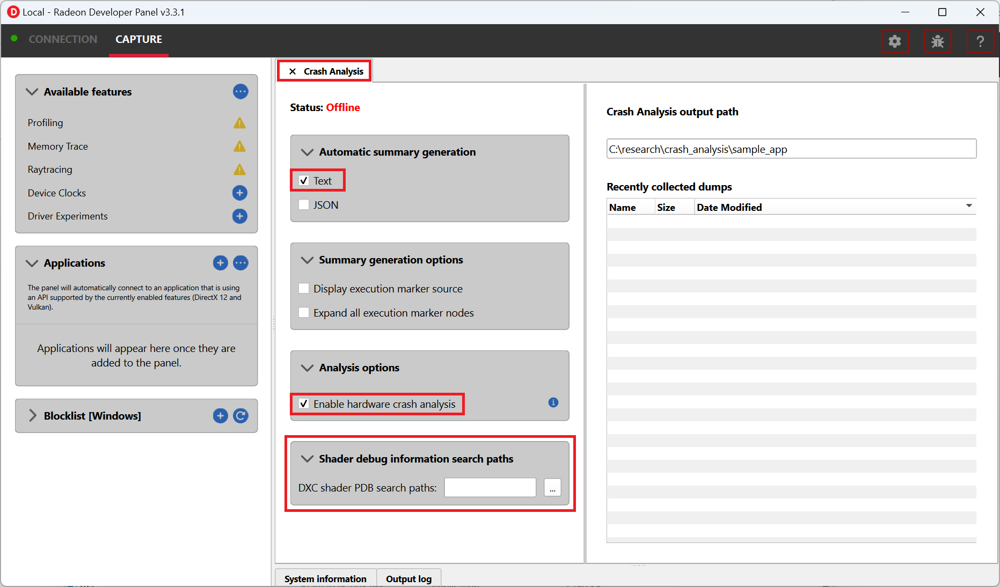
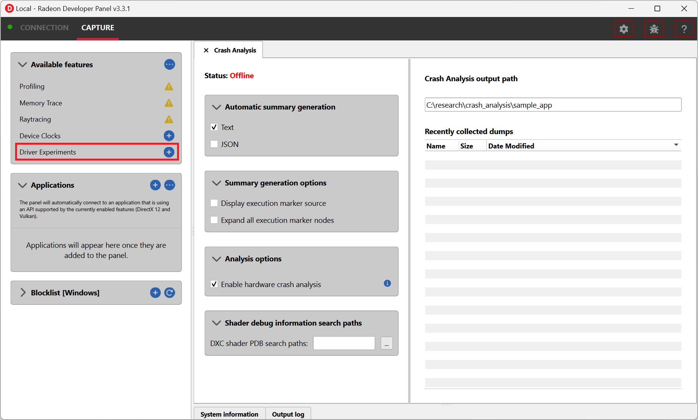
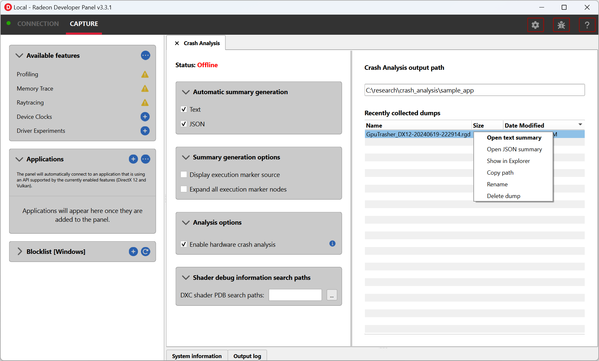

Radeon™ GPU Detective (RGD)
===========================
Radeon GPU Detective (RGD) is a tool for post-mortem analysis of GPU crashes.

.. toctree::
   :maxdepth: 2
   :caption: Contents:

   help_manual.rst

.. _quickstart-guide:

Quickstart Guide
----------------

This guide will get you up and running with RGD, a tool for post-mortem GPU crash analysis. You will learn how to generate AMD GPU crash dumps and crash analysis reports.

.. note::
   Review these requirements to make sure that this tool is relevant for your use case:
   
   * RGD v1.3 supports **DirectX12** and **Vulkan**.
   * **Windows 10 or 11**.
   * **RDNA™2** (RX 6000 series) **or RDNA™3** (RX 7000 series) card.
   * Must **TDR** (we don't catch it if there is no TDR).
   * **Reproducible crashes** (you will have to reproduce the crash to capture a GPU crash dump).

Preparation
^^^^^^^^^^^
* Download the latest Windows version of `Radeon Developer Tools Suite (RDTS) <https://gpuopen.com/rdts-windows/>`_ and extract the .zip archive.

Capture GPU crash dump
^^^^^^^^^^^^^^^^^^^^^^

1. Before you start, if you ever changed the TdrLevel registry setting, make sure it is set to TdrLevelRecover(3).
2. Run RDP GUI app (RadeonDeveloperPanel.exe).
3. Under CAPTURE -> "Available features", enable "Crash Analysis".

4. Under the "Crash Analysis" tab, make sure that the Text checkbox is checked for the automatic crash summary generation.

5. Run the crashing app and reproduce the TDR.

.. note::
   You can always generate the text or JSON summary files from an .rgd file after has been captured. This can be done either by right-clicking the .rgd file entry in RDP and using the context menu or by invoking the rgd command line tool directly (run ``rgd -h`` to see the help manual).

Capture GPU crash dump with Driver Experiments enabled
^^^^^^^^^^^^^^^^^^^^^^^^^^^^^^^^^^^^^^^^^^^^^^^^^^^^^^

1. Under CAPTURE -> "Available features", enable "Driver Experiments"

2. Under the "Driver Experiments" tab, select the API you want to enable the experiments for (DirectX12 or Vulkan).

3. Under the "Driver Experiments" tab, enable/select the experiments you want to activate.

4. Follow the steps in the previous section to capture the GPU crash dump.

Crash analysis
^^^^^^^^^^^^^^

After system recovery, if the crash was detected, you should see a new .rgd file under “Recently collected dumps”.
The .rgd file is a binary file that stores information about the crash.
RGD doesn't offer a GUI tool to open these files.
Instead, you can convert them to a report in text or JSON format directly from RDP.
To do it, right-click and select “Open text summary”:

This will open the .txt crash analysis file which includes information that can help narrow down the search for the crash's root cause::

    Command Buffer ID: 0x617 (Queue type: Direct)
    =============================================
    [>] "Frame 362 CL0"
     ├─[X] "Depth + Normal + Motion Vector PrePass"
     ├─[X] "Shadow Cascade Pass"
     ├─[X] "TLAS Build"
     ├─[X] "Classify tiles"
     ├─[X] "Trace shadows"
     ├─[X] ----------Barrier----------
     ├─[X] "Denoise shadows"
     ├─[X] "GltfPbrPass::DrawBatchList"
     ├─[X] "Skydome Proc"
     ├─[X] "GltfPbrPass::DrawBatchList"
     ├─[>] "DownSamplePS"
     │  ├─[X] ----------Barrier----------
     │  ├─[>] Draw(VertexCount=3, InstanceCount=1)
     │  ├─[>] Draw(VertexCount=3, InstanceCount=1)
     │  ├─[>] Draw(VertexCount=3, InstanceCount=1)
     │  ├─[>] Draw(VertexCount=3, InstanceCount=1)
     │  ├─[>] Draw(VertexCount=3, InstanceCount=1)
     │  └─[>] ----------Barrier----------
     ├─[>] "Bloom"
     │  ├─[>] "BlurPS"
     │  │  ├─[>] ----------Barrier----------
     │  │  ├─[>] Draw(VertexCount=3, InstanceCount=1)
     │  │  ├─[>] Draw(VertexCount=3, InstanceCount=1)
     │  │  └─[ ] ----------Barrier----------
     │  ├─[ ] ----------Barrier----------
     │  ├─[ ] Draw(VertexCount=3, InstanceCount=1)
     │  ├─[ ] Draw(VertexCount=3, InstanceCount=1)
     │  ├─[ ] "BlurPS"
     │  ├─[ ] Draw(VertexCount=3, InstanceCount=1)
     │  └─[ ] ----------Barrier----------
     └─[ ] "Indirect draw simple"

To learn about the contents of the crash analysis summary .txt file, please refer to the :doc:`help_manual`.

DISCLAIMER
----------
The information contained herein is for informational purposes only, and is subject to change without notice. While every
precaution has been taken in the preparation of this document, it may contain technical inaccuracies, omissions and typographical
errors, and AMD is under no obligation to update or otherwise correct this information. Advanced Micro Devices, Inc. makes no
representations or warranties with respect to the accuracy or completeness of the contents of this document, and assumes no
liability of any kind, including the implied warranties of noninfringement, merchantability or fitness for particular purposes, with
respect to the operation or use of AMD hardware, software or other products described herein. No license, including implied or
arising by estoppel, to any intellectual property rights is granted by this document. Terms and limitations applicable to the purchase
or use of AMD’s products are as set forth in a signed agreement between the parties or in AMD's Standard Terms and Conditions
of Sale.

AMD, the AMD Arrow logo, Radeon, Ryzen, CrossFire, RDNA and combinations thereof are trademarks of Advanced Micro Devices, Inc. Other product names used in
this publication are for identification purposes only and may be trademarks of their respective companies.
© 2024 Advanced Micro Devices, Inc. All rights reserved.