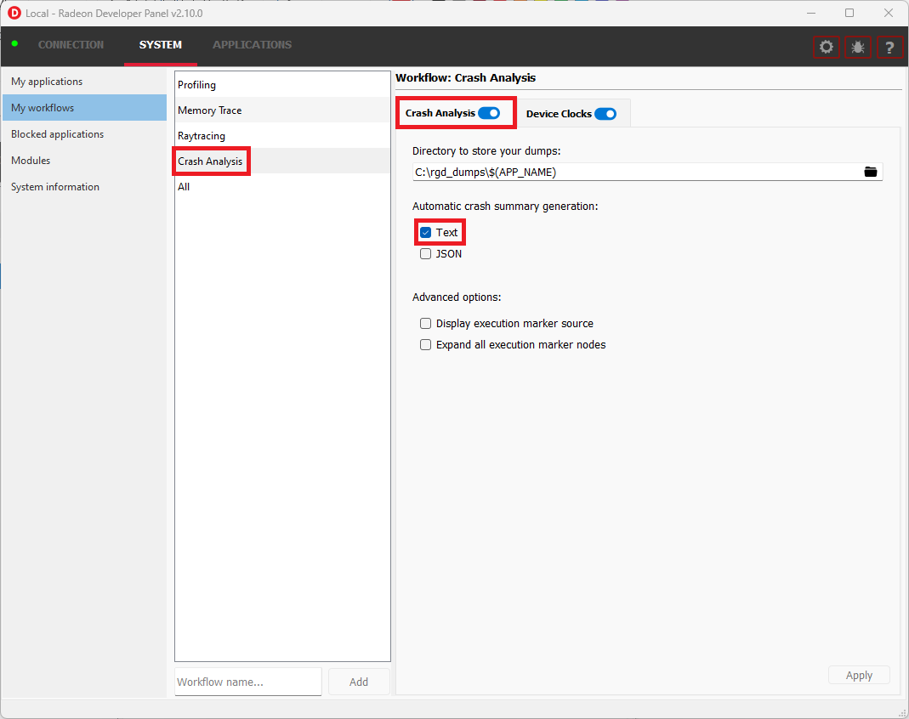
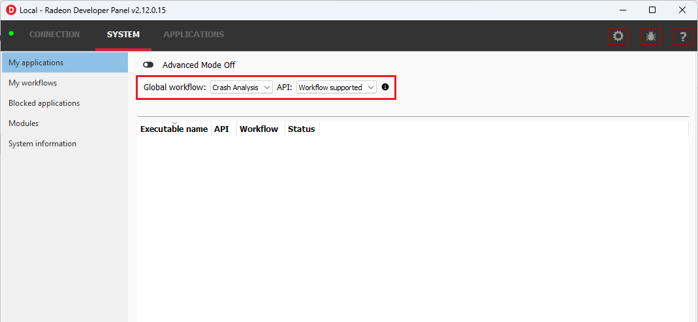
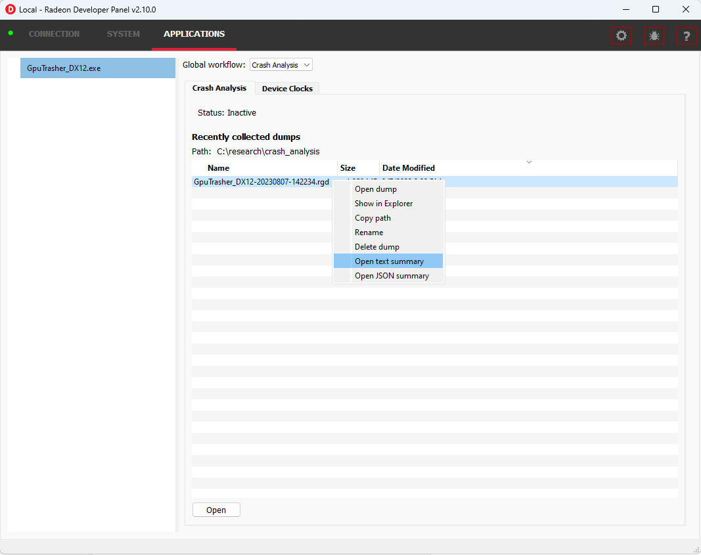

.. Radeon GPU Detective Quickstart Guide

Quickstart Guide
================

This guide will get you up and running with RGD, a tool for post-mortem GPU crash analysis. You will learn how to generate AMD GPU crash dumps and crash analysis reports.

.. note::
   Review these requirements to make sure that this tool is relevant for your use case:
   
   * RGD v1.0 only supports **DirectX12**.
   * **Windows 10 or 11**.
   * **RDNA™2** (RX 6000 series) **or RDNA™3** (RX 7000 series) card.
   * Must **TDR** (we don't catch it if there is no TDR).
   * **Reproducible crashes** (you will have to reproduce the crash to capture a GPU crash dump).

Preparation
-----------
* Download the latest Windows version of `Radeon Developer Tools Suite (RDTS) <https://gpuopen.com/rdts-windows/>`_ and extract the .zip archive.

Capture GPU crash dump
----------------------
1. Before you start, if you ever changed the TdrLevel registry setting, make sure it is set to TdrLevelRecover(3).
2. Run RDP GUI app (RadeonDeveloperPanel.exe).
3. Under SYSTEM -> “My workflows” -> Crash Analysis, make sure that the Text checkbox is checked for the automatic crash summary generation:

4. Configure “Crash Analysis” as the global workflow under SYSTEM -> My applications:

5. Run the crashing app and reproduce the TDR.

.. note::
   You can always generate the text or JSON summary files from an .rgd file after has been captured. This can be done either by right-clicking the .rgd file entry in RDP and using the context menu or by invoking the rgd command line tool directly (run ``rgd -h`` to see the help manual).

Crash analysis
--------------
After system recovery, if the crash was detected, you should see a new .rgd file under “Recently collected dumps”.
The .rgd file is a binary file that stores information about the crash.
RGD doesn't offer a GUI tool to open these files.
Instead, you can convert them to a report in text or JSON format directly from RDP.
To do it, right-click and select “Open text summary”:

This will open the .txt crash analysis file which includes information that can help narrow down the search for the crash's root cause::

    Command Buffer ID: 0x107c
    =========================
    [>] "Frame 1040 CL0"
     ├─[X] "Depth + Normal + Motion Vector PrePass"
     ├─[X] "Shadow Cascade Pass"
     ├─[X] "TLAS Build"
     ├─[X] "Classify tiles"
     ├─[X] "Trace shadows"
     ├─[X] "Denoise shadows"
     ├─[X] "GltfPbrPass::DrawBatchList"
     ├─[X] "Skydome Proc"
     ├─[X] "GltfPbrPass::DrawBatchList"
     ├─[>] "DownSamplePS"
     │  ├─[X] Draw
     │  ├─[X] Draw
     │  ├─[X] Draw
     │  ├─[>] Draw
     │  └─[>] Draw
     └─[>] "Bloom"
        ├─[>] "BlurPS"
        │  ├─[>] Draw
        │  └─[>] Draw
        ├─[>] Draw
        ├─[>] "BlurPS"
        │  ├─[>] Draw
        │  └─[>] Draw
        ├─[ ] Draw
        ├─[ ] "BlurPS"
        ├─[ ] Draw
        ├─[ ] "BlurPS"
        ├─[ ] Draw
        ├─[ ] "BlurPS"
        └─[ ] Draw

To learn about the contents of the crash analysis summary .txt file, please refer to the :doc:`help_manual`.